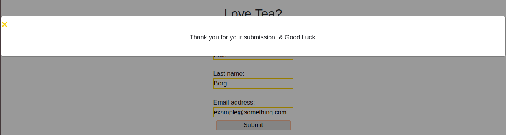

# jQuery Tea 

Nutze jQuery um den Tee-Shop fertigzustellen. Hier ist ein jQuery-Cheat sheet: https://oscarotero.com/jquery/

**Aufgabe**:
* Mithilfe der Elemente, die schon in `index.html` vorhanden sind, zeig ein Popup-Fenster an, wenn der Nutzer auf "Submit" unten im Formular klickt. Das Popup soll mit einem Klick auf `.close-modal` geschlossen werden können, oder mit einem Klick irdenwoanders im Fenster. 

* Wenn man auf die Teekanne oben auf der Seite klickt, soll sie sich um 20° drehen. Wenn man sie nochmal klickt, soll sie sich wieder zurück drehen. 

* Wenn der Nutzer mit der Maus über `.tea-desc` in `selection__option`s geht, soll der Text durch einen anderen Satz ausgetauscht werden, z.B. "Great tea for a cold night", "Rich in flavours" etc.

**Anmerkungen**: 
* Zeit: 1 Stunde
* Orientiere dich an den Abbildungen
